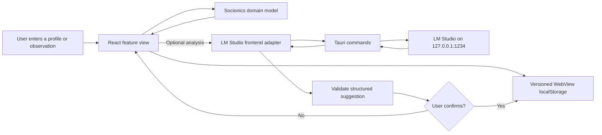

# Data and AI workflow

Akasha keeps user-entered evidence separate from theory and AI interpretation. The optional local model proposes a link; it never writes evidence by itself.

## Trust boundaries

- **Repository:** contains application source and synthetic test data only.
- **WebView storage:** contains private profiles, observations, relationships, and notes on the current device.
- **Tauri boundary:** exposes only the two LM Studio commands registered in `src-tauri/src/lib.rs`.
- **Local model boundary:** receives the selected type, function catalog, situation, and observed behavior when the user requests analysis.
- **Human decision:** remains the final gate before an AI suggestion becomes saved evidence.

There is currently no cloud backend, account system, telemetry pipeline, sync engine, export workflow, or automatic backup.
